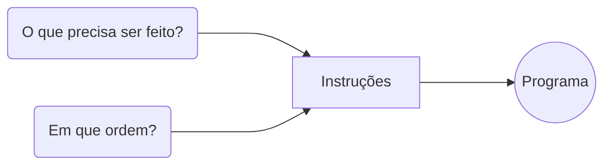

# Módulo 1 - Conteúdo de Abertura

## Aula 1 - Pensamento Computacional

### Pensamento Computacional

É constituído por:

1. Decomposição
2. Reconhecimento de Padrões
3. Abstração
4. Design de Algoritmos

### Raciocínio Lógico

| Indução | Dedução | Abdução |
|--|--|--|
| Fenômeno | Leis e Teorias | Conclusão |
| Leis e Teorias | Previsões e Explicações | Premissa

### Decomposição

Consiste em decompor um problema complexo em problemas menores, mais fáceis e gerenciáveis.

### Padrões

- Modelo Base
- Estrutura Invariante 
- Repetição

#### Por que usar padrões?

- Padrões permitem generalizar para obter uma mesma solução para problemas diferentes.

### Abstração

Utilizada para classificar:
1. Características 
2. Pontos essenciais
3. Generalizar

### Algoritmos

 #### Desenvolvimento do Programa

| 1. Análise | 2. Algoritmo | 3. Codificação | 
|--|--|--|
|Estudo e definição dos dados de entrada e saída|Descreve o problema por meio de ferramentas|Codificado de acordo c/ uma linguagem de programação|

#### Como construir um algoritmo?

1. Compreender o problema
2. Definir os dados de entrada
3. Definir processamento
4. Definir os dados de saída
5. Utilizar método de construção
6. Teste e diagnóstico
