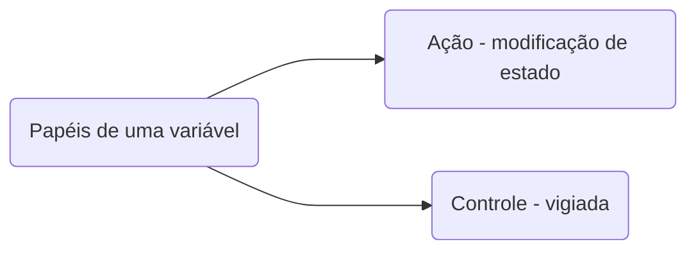

# Módulo 1 - Conteúdo de Abertura

## Aula 3 - Fundamentos de algoritmos

### Variável

- Possui variações
- É incerta
- Restrita ao seu tipo (string etc.)
- Mutável
- Inconstante

#### Regras:

1. Atribuição de 1 ou mais caracteres;
2. Primeiro letra, não número
3. Sem espaços em branco
4. Vedado o uso de palavras reservadas
5. Caracteres e números

### Instruções Primitivas

- Ações sobre dados ---> Cálculos matemáticos*

### Estruturas Condicionais e Operadores*

- Expressa uma condição ou suposição;
- Operadores: =, <>, >, <, >=, <=; 
- Simples, composta ou encadeada
- Operadores lógicos: AND, OR, NOT. 

`*Prioridade de operações matemáticas`

### Estruturas de Repetição

- Chamados de:
	1. Laços
	2. Controle de fluxo
	3. Malhas de repetição
	4. Repetição
	5. Loop

- **Possui condição de parada.**

### Vetores e Matrizes

#### Vetores:
`"É caracterizado por uma variável dimensionada com tamanho pré-fixado."`

#### Matrizes:
`"Tabela organizada por linhas e colunas no formato mxn."`

### Funções
- Similar ao conceito de função da matemática: 
	 `"Blocos de instruções que realizam tarefas específicas."`
- Determinada por nomes e parâmetros.

### Instruções de entrada e saída

#### Entrada 
`"Inserção e recebimento de dados do mundo real por meio de ação de alguma inferface, teclado, mouse, arquivos etc."`

#### Saída
`"Impressão dos dados do mundo abstrato, digital por meio da ação de alguma interface."`

- Saída programada ou por interrupção;
- Casos:
-- Bem sucedida;
-- Erro de sintaxe ou outro;
-- Erro de programação;
-- Problemas com interface.
