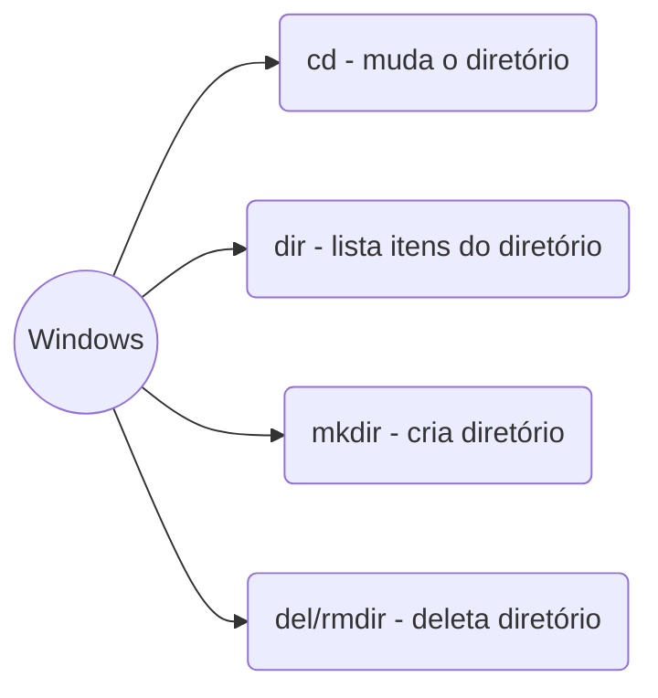

# Módulo 1 - Introdução ao Git e ao GitHub
## Aula 1 - Introdução ao Git e ao GitHub
Sem anotações. 

## Aula 2 - Navegação
- Command Line Interface
- Atalhos principais:

## Aula 3 - Como o Git funciona?

### SHA
- *Secure Hash Algorithm*
- Forma curta de representar um arquivo
- Código único

### Objetos Internos
- Blobs:
-- Metadados
-- Tipo de objeto
-- Conteúdo
-- Tamanho string
-- /0
-- SHA1

- Tree:
-- Armazena blobs
-- SHA1

- Commit:
-- Tree
-- Parente
-- Timestamp
-- Autor
-- Mensagem
-- SHA1

### Chave SSH
Conexão encriptada entre duas máquinas.

### Token de Acesso Pessoal
- Senha com validade.
- Cria-se na plataforma do GitHub.

## Aula 4 - Primeiros Comandos

### Comandos Git
- git init --> inicia um repositório
- git add
- git commit

## Aula 5 - Ciclo de Vida

- **Tracked**
-- Unmodified
-- Modified
-- Staged

- **Untracked**

- **Ambiente de desenvolvimento**
-- Working Directory
-- Staging Area
-- Local Repository --> tem que ser commit

- **Servidor**
-- Remote Repository

## Aula 6 - Intro GitHub

### Push
- Empurrar um commit do repositório local;
- git remote add origin <link do repositório>;
- git push origin main

## Aula 7 - Como resolver conflitos no GitHub

### Mesh 
Usar quando o repositório for editado e upado por usuários diferentes.
