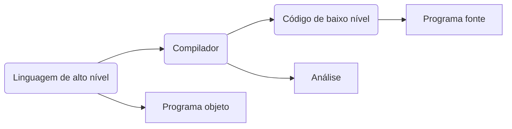
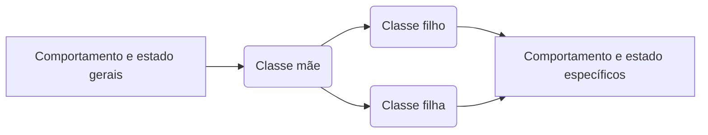

# Módulo 1 - Conteúdo de Abertura

## Aula 4 - Linguagens de Programação

### Problemas

- De decisão:
-- Caráter lógico - sim ou não;
-- Ideia ---> pertencimento

- De busca:
-- Relacionamento binário
-- Objetivo ---> Semelhante ao nome

- De otimização:
-- Objetivo ---> máx. ou mín. de uma função

### Linguagem de Programação

Definição:

`"Método padronizado composto por um conjunto de regras sintáticas e semânticas de implementação de um código fonte."`

**Línguas compiladas:** C++, Rust, Go...
**Línguas Interpretadas:** Python, PHP, Ruby, JS.

### Desenvolvimento de Programas

Diretrizes:
1. Legibilidade
2. Redigibilidade
3. Confiabilidade
4. Custo

### Análises de Código (Compilador) 

**Análise Léxica**
1. Particionar (agrupar tokens)
2. Classificar
3. Eliminar (espaços, comentários...)

**Análise Sintática** 
- Interliga os constituintes da sentença, dando estrutura a ela. 

**Análise Semântica**
- Estuda o significado; palavras, frases, sinais, símbolos...

### Paradigma

Definição: 

`"Forma de resolução de problemas com diretrizes e limitações específicas de cada paradigma."`

#### Paradigma Estruturado ---> C 

##### Conceitos
1. Sequência
2. Decisão
3. Iteração

##### Utilização
4. Problemas simples e diretos;
5. Aprender programação. 

#### Orientado a objeto 
- Análogo ao mundo real
- Definição de objeto:
	- `"Possui características específicas, comportamentos e estado."`

##### Pilares de Orientação a Objeto:

1. Herança

2. Encapsulamento
3. Polimorfismo
4. Abstração
